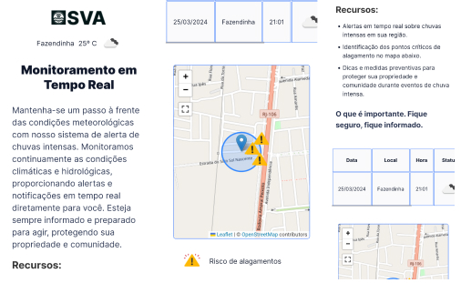

# SVA - Sistema de Vigilância de Alagamentos

O SVA é uma aplicação web que oferece monitoramento em tempo real de condições meteorológicas, alertando sobre chuvas intensas e pontos críticos de alagamento. Desenvolvido como parte de uma atividade de extensão da Universidade Cruzeiro do Sul, este projeto tem como objetivo fornecer informações essenciais para ajudar indivíduos e comunidades a se prepararem e se protegerem durante eventos climáticos adversos.

## Recursos Principais:

- **Alertas em Tempo Real:** Receba notificações instantâneas sobre chuvas intensas na sua região, permitindo que você esteja sempre preparado para agir e se proteger.

- **Mapeamento de Pontos Críticos:** Identifique áreas propensas a alagamentos por meio de marcadores no mapa, permitindo uma visualização clara dos pontos de risco na sua localidade.

- **Dicas de Segurança:** Acesse recomendações e medidas preventivas para proteger sua propriedade e comunidade durante períodos de chuva intensa, garantindo a segurança de todos.

## Tecnologias Utilizadas:

- **HTML, CSS, JavaScript:** A base da aplicação, fornecendo a estrutura, estilo e interatividade necessários para uma experiência de usuário intuitiva.

- **Leaflet.js:** Uma biblioteca de mapeamento interativa que permite a exibição de mapas dinâmicos e a adição de marcadores para pontos de interesse.

- **API do OpenWeatherMap:** Integração com uma fonte de dados confiável para obter previsões meteorológicas precisas e atualizadas em tempo real.

## Como Usar:

1. **Acesso à Aplicação:** Basta acessar a aplicação através do navegador web para começar a usar. Não é necessário nenhum cadastro ou login.

2. **Monitoramento em Tempo Real:** Ao abrir a aplicação, você receberá automaticamente alertas sobre chuvas intensas na sua região e visualizará os pontos críticos de alagamento no mapa.

3. **Exploração de Recursos:** Além dos alertas e mapeamento, explore as dicas de segurança fornecidas para garantir a proteção da sua propriedade e comunidade.

## Como Contribuir:

- Se você é um desenvolvedor, sinta-se à vontade para contribuir com novos recursos, correções de bugs ou melhorias na interface de usuário. Basta fazer um fork do repositório, fazer suas alterações e enviar um pull request.

- Se você é um usuário, deixe seu feedback sobre a aplicação. Sua opinião é fundamental para continuarmos aprimorando o SVA e torná-lo ainda mais útil e eficaz.

